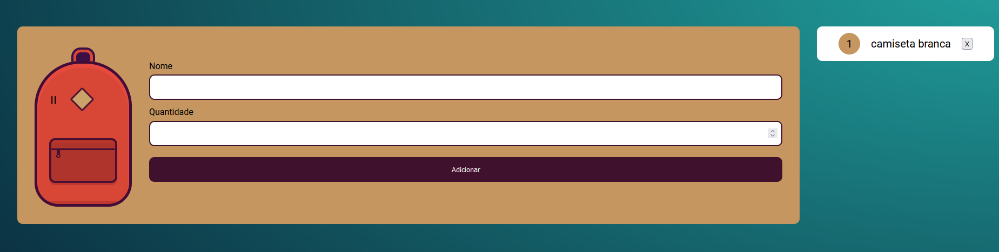

<h1 align="center">
  

  
 <a href="mochila-de-viagem-nktj03e4h-deivid94.vercel.app">MOCHILA DE VIAGEM.</a>
</h1>

<blockquote align="center"> “Faça seu melhor, mas sempre com prazo de entrega!”</blockquote>
 

  ## SOBRE O PROJETO
  

   O projeto da mochila tem como objetivo servir como uma lista de coisas que voce deseja colcoar na sua mochila ou mala para que nao esqueca nada,
    vo pode adicionar itens, remover itens, atualizar esses itens, igualmente

 
 
 
 

  

  

  

    <a href="https://www.linkedin.com/in/deivid-martins1994/">
  	&nbsp;&nbsp;&nbsp;|&nbsp;&nbsp;&nbsp;
  <a href="https://github.com/deivid94">
   &nbsp;&nbsp;&nbsp;|&nbsp;&nbsp;&nbsp;
  <a href="https://www.hackerrank.com/md031194">
   

